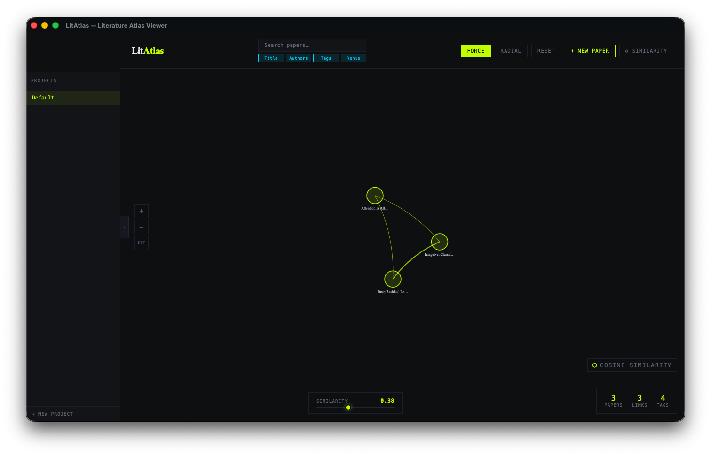

# LitAtlas -- Literature Atlas Viewer

This project provides a local paper-relation viewer to manage and present relations between papers.

Due to the tremendous growth of research, it is hard for us to keep track of every paper's information. With a graph-based viewer, it will be easier for us to derive the connection between each paper of interest.



## Functions

 - Graph View 
    - [X] Present paper as node
    - [X] Present edge as similarity
    - [X] Zoom in/out
    - [X] Show HashTag connections between papers.
    - [ ] If two nodes' don't have similarity from LLM, the viewer will show the similarity from HashTag.
 - Paper information
    - [X] Add paper
    - [X] Delete paper
    - [X] Edit paper
    - [X] Upload PDF
 - Similarity between Papers
    - [X] Using hashtag (cosine similarity)
    - [ ] Using LLM
      - [X] Simple usage. (Concate the selected information in on string.)
      - [X] Weighted information.
      - [ ] Include PDFs.
 - Search
    - [X] Paper Title
    - [X] Venue
    - [X] Author
    - [X] Hashtag
 - Backup


## Install Issues:

### Issue 1: 
“PaperGraph.app” is damaged and can’t be opened. You should eject the disk image.

#### Reason: 
The downloaded unauthorized application will be quarantined by default.
#### Solution:  
```bash
# replace /Applications/YourAppName.app with actual APP path 
# (default will be /Applications/PaperGraph.app)
xattr -cr /Applications/YourAppName.app
```